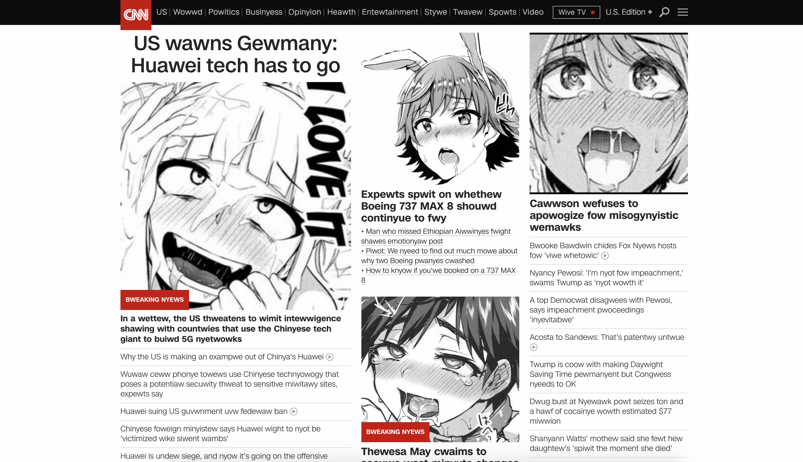

<em>ahegao is responsible for the images, the <a href="https://chrome.google.com/webstore/detail/owo/jolaggjkdhhgcdhcjjhfkkbllefoggob">OWO Chrome extension</a> is responsible for the text manipulation</em>

# ahegao (unreleased)
I own none of these pictures app is rated M for Might make you uncomfortable

Once upon a time a young adult was sitting at his computer when a tiny train of thought appeared out of nowhere and disappeared
into nowhere in just as much time as it took to appear

Before the train of thought vanished it left behind a small thought:

<b><em>"What if every image on the internet was replaced with anime girls*?"</em></b>

Thus ahegao was born

ahegao will replace every (re: > 90%) image on your internet with anime pics I spent too much time looking for on Google Images

There are some really talented artists out there, big shout out. The source of each image can be viewed via Right click on image -> Inspect element -> The value of the src field inside the img tag.

Currently supports:

• Anime girls

• Anime boys

• Anime romance (heterosexual) (some cute some lewd)

• Anime romance (homosexual) (some cute some lewd)

• Traps (lewd)

• Ahegao, of course (lewd)

• Random mix of all the above

Future implementations:

o Users should be able to add their own lists and own links

o If a mobile version can somehow be developed that would be straight cash $$$$$$$$$$$

o Feel free to add link suggestions as pull requests or issues my fellows

<h1>As seen from the content it can be inferred that this application provides content for mature audiences.

Why? This content includes sexual themes suggestive themes some lewd material implicitly and romance themes. An "E for everyone" version would have stopped at Anime girls and Anime boys.

Feel free to view the other stuff on my Github for higher grade JavaScript and projects with more reasonable use cases and motivations.
</h1>

How to deploy: git clone to computer, go to chrome://extensions and turn on developer mode, load unpacked the folder of the cloned repo, enjoy. Fun way to prank your friends (re: prank responsibly)

This project is also a testament to the freedom one has with respect to customizing how s/he consumes the web should s/he be familiar with web development technologies. <b>If you don't like this, that's great -- learn JavaScript and release a version that you do like, learning about how you can now alter your web consumption experience thanks to the knowledge gained while building your manifestation of an ideal image replacer.</b>

^* = Anime girls were my first thought. I don't know why girls instead of boys, maybe if I was homosexual I would have thought to use anime boys images first...aside, ahegao serves content for several different niches, so there are definitely equal opportunities for individual enjoyment. 

